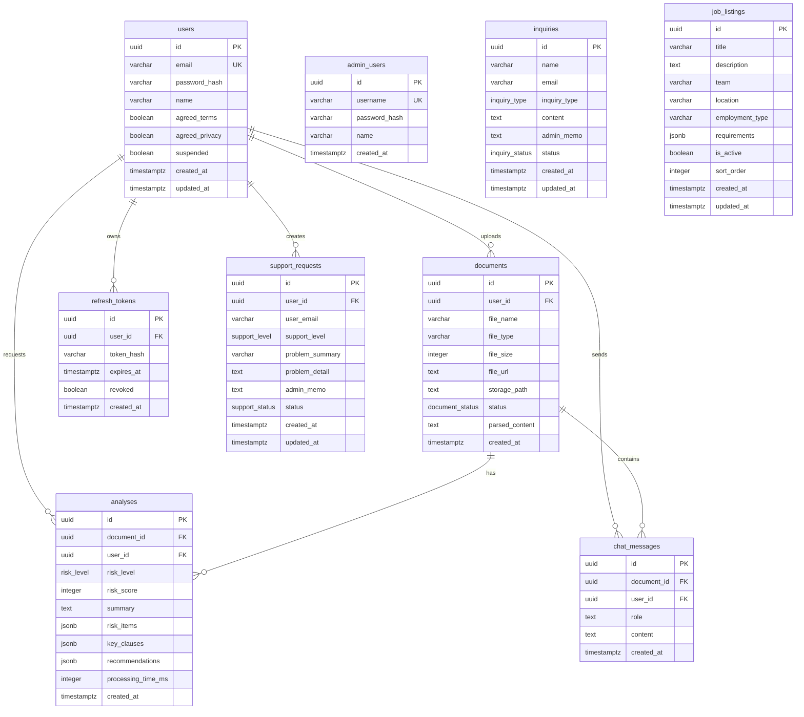

# ContractInsight(Lawdy) 데이터베이스 스키마 및 프롬프트 정의서

> 작성일: 2025-01-14
> 프로젝트: ContractInsight (Lawdy)
> 데이터베이스: Supabase (PostgreSQL)

---

## 목차

1. [데이터베이스 개요](#1-데이터베이스-개요)
2. [ERD 다이어그램](#2-erd-다이어그램)
3. [SQL DDL 스키마](#3-sql-ddl-스키마)
4. [ENUM 타입 정의](#4-enum-타입-정의)
5. [테이블 정의](#5-테이블-정의)
6. [계약서 분석 프롬프트](#6-계약서-분석-프롬프트)

---

## 1. 데이터베이스 개요

| 항목 | 값 |
|------|-----|
| DBMS | PostgreSQL (Supabase) |
| Project ID | `auxiobfcqaqwljujxowp` |
| RLS | 모든 테이블 활성화 |
| 테이블 수 | 9개 |

### 테이블 요약

| 테이블 | 설명 | 레코드 수 |
|--------|------|-----------|
| `users` | 사용자 계정 정보 | 10 |
| `documents` | 업로드된 계약서 파일 | 17 |
| `analyses` | 계약서 분석 결과 | 15 |
| `chat_messages` | 문서별 Q&A 채팅 | 36 |
| `refresh_tokens` | JWT 리프레시 토큰 | 34 |
| `admin_users` | 관리자 계정 | 1 |
| `inquiries` | 고객 문의 | 1 |
| `support_requests` | 기술 지원 요청 | 2 |
| `job_listings` | 채용 공고 | 5 |

---

## 2. ERD 다이어그램



---

## 3. SQL DDL 스키마

### 3.1. ENUM 타입 생성

```sql
-- Enable UUID extension
CREATE EXTENSION IF NOT EXISTS "uuid-ossp";

-- Document status enum
CREATE TYPE document_status AS ENUM (
  'uploading',
  'parsing',
  'analyzing',
  'completed',
  'failed'
);

-- Risk level enum
CREATE TYPE risk_level AS ENUM (
  'low',
  'medium',
  'high'
);

-- Inquiry type enum
CREATE TYPE inquiry_type AS ENUM (
  'general',
  'other',
  'technical',
  'payment'
);

-- Inquiry status enum
CREATE TYPE inquiry_status AS ENUM (
  'received',
  'processing',
  'completed'
);

-- Support level enum
CREATE TYPE support_level AS ENUM (
  'low',
  'normal',
  'high',
  'urgent'
);

-- Support status enum
CREATE TYPE support_status AS ENUM (
  'received',
  'processing',
  'completed'
);
```

### 3.2. 테이블 생성

```sql
-- Users table
CREATE TABLE users (
  id UUID PRIMARY KEY DEFAULT uuid_generate_v4(),
  email VARCHAR(255) UNIQUE NOT NULL,
  password_hash VARCHAR(255) NOT NULL,
  name VARCHAR(100) NOT NULL,
  agreed_terms BOOLEAN DEFAULT FALSE,
  agreed_privacy BOOLEAN DEFAULT FALSE,
  suspended BOOLEAN DEFAULT FALSE,
  created_at TIMESTAMP WITH TIME ZONE DEFAULT NOW(),
  updated_at TIMESTAMP WITH TIME ZONE DEFAULT NOW()
);

-- Documents table
CREATE TABLE documents (
  id UUID PRIMARY KEY DEFAULT uuid_generate_v4(),
  user_id UUID NOT NULL REFERENCES users(id) ON DELETE CASCADE,
  file_name VARCHAR(255) NOT NULL,
  file_type VARCHAR(50) NOT NULL,
  file_size INTEGER NOT NULL,
  file_url TEXT,
  storage_path TEXT,
  status document_status DEFAULT 'uploading',
  parsed_content TEXT,
  created_at TIMESTAMP WITH TIME ZONE DEFAULT NOW()
);

-- Analyses table
CREATE TABLE analyses (
  id UUID PRIMARY KEY DEFAULT uuid_generate_v4(),
  document_id UUID NOT NULL REFERENCES documents(id) ON DELETE CASCADE,
  user_id UUID NOT NULL REFERENCES users(id) ON DELETE CASCADE,
  risk_level risk_level,
  risk_score INTEGER CHECK (risk_score >= 0 AND risk_score <= 100),
  summary TEXT,
  risk_items JSONB DEFAULT '[]'::jsonb,
  key_clauses JSONB DEFAULT '[]'::jsonb,
  recommendations JSONB DEFAULT '[]'::jsonb,
  processing_time_ms INTEGER,
  created_at TIMESTAMP WITH TIME ZONE DEFAULT NOW()
);

-- Chat messages table
CREATE TABLE chat_messages (
  id UUID PRIMARY KEY DEFAULT gen_random_uuid(),
  document_id UUID NOT NULL REFERENCES documents(id) ON DELETE CASCADE,
  user_id UUID NOT NULL REFERENCES users(id) ON DELETE CASCADE,
  role TEXT NOT NULL CHECK (role IN ('user', 'assistant')),
  content TEXT NOT NULL,
  created_at TIMESTAMP WITH TIME ZONE DEFAULT NOW()
);

-- Refresh tokens table
CREATE TABLE refresh_tokens (
  id UUID PRIMARY KEY DEFAULT uuid_generate_v4(),
  user_id UUID NOT NULL REFERENCES users(id) ON DELETE CASCADE,
  token_hash VARCHAR(255) NOT NULL,
  expires_at TIMESTAMP WITH TIME ZONE NOT NULL,
  revoked BOOLEAN DEFAULT FALSE,
  created_at TIMESTAMP WITH TIME ZONE DEFAULT NOW()
);

-- Admin users table
CREATE TABLE admin_users (
  id UUID PRIMARY KEY DEFAULT uuid_generate_v4(),
  username VARCHAR(100) UNIQUE NOT NULL,
  password_hash VARCHAR(255) NOT NULL,
  name VARCHAR(100),
  created_at TIMESTAMP WITH TIME ZONE DEFAULT NOW()
);

-- Inquiries table
CREATE TABLE inquiries (
  id UUID PRIMARY KEY DEFAULT uuid_generate_v4(),
  name VARCHAR(100) NOT NULL,
  email VARCHAR(255) NOT NULL,
  inquiry_type inquiry_type DEFAULT 'general',
  content TEXT NOT NULL,
  admin_memo TEXT,
  status inquiry_status DEFAULT 'received',
  created_at TIMESTAMP WITH TIME ZONE DEFAULT NOW(),
  updated_at TIMESTAMP WITH TIME ZONE DEFAULT NOW()
);

-- Support requests table
CREATE TABLE support_requests (
  id UUID PRIMARY KEY DEFAULT uuid_generate_v4(),
  user_id UUID REFERENCES users(id) ON DELETE SET NULL,
  user_email VARCHAR(255) NOT NULL,
  support_level support_level DEFAULT 'normal',
  problem_summary VARCHAR(500) NOT NULL,
  problem_detail TEXT,
  admin_memo TEXT,
  status support_status DEFAULT 'received',
  created_at TIMESTAMP WITH TIME ZONE DEFAULT NOW(),
  updated_at TIMESTAMP WITH TIME ZONE DEFAULT NOW()
);

-- Job listings table
CREATE TABLE job_listings (
  id UUID PRIMARY KEY DEFAULT uuid_generate_v4(),
  title VARCHAR(200) NOT NULL,
  description TEXT NOT NULL,
  team VARCHAR(100) NOT NULL,
  location VARCHAR(100) NOT NULL,
  employment_type VARCHAR(50) NOT NULL,
  requirements JSONB DEFAULT '[]'::jsonb,
  is_active BOOLEAN DEFAULT TRUE,
  sort_order INTEGER DEFAULT 0,
  created_at TIMESTAMP WITH TIME ZONE DEFAULT NOW(),
  updated_at TIMESTAMP WITH TIME ZONE DEFAULT NOW()
);
```

### 3.3. 인덱스 생성

```sql
-- Documents indexes
CREATE INDEX idx_documents_user_id ON documents(user_id);
CREATE INDEX idx_documents_status ON documents(status);
CREATE INDEX idx_documents_created_at ON documents(created_at DESC);

-- Analyses indexes
CREATE INDEX idx_analyses_document_id ON analyses(document_id);
CREATE INDEX idx_analyses_user_id ON analyses(user_id);
CREATE INDEX idx_analyses_created_at ON analyses(created_at DESC);

-- Refresh tokens indexes
CREATE INDEX idx_refresh_tokens_user_id ON refresh_tokens(user_id);
CREATE INDEX idx_refresh_tokens_token_hash ON refresh_tokens(token_hash);
```

### 3.4. 트리거 함수

```sql
-- Updated_at trigger function
CREATE OR REPLACE FUNCTION update_updated_at_column()
RETURNS TRIGGER AS $$
BEGIN
  NEW.updated_at = NOW();
  RETURN NEW;
END;
$$ LANGUAGE 'plpgsql';

-- Apply trigger to users table
CREATE TRIGGER update_users_updated_at
  BEFORE UPDATE ON users
  FOR EACH ROW
  EXECUTE FUNCTION update_updated_at_column();

-- Apply trigger to inquiries table
CREATE TRIGGER update_inquiries_updated_at
  BEFORE UPDATE ON inquiries
  FOR EACH ROW
  EXECUTE FUNCTION update_updated_at_column();

-- Apply trigger to support_requests table
CREATE TRIGGER update_support_requests_updated_at
  BEFORE UPDATE ON support_requests
  FOR EACH ROW
  EXECUTE FUNCTION update_updated_at_column();

-- Apply trigger to job_listings table
CREATE TRIGGER update_job_listings_updated_at
  BEFORE UPDATE ON job_listings
  FOR EACH ROW
  EXECUTE FUNCTION update_updated_at_column();
```

### 3.5. RLS (Row Level Security) 설정

```sql
-- Enable RLS on all tables
ALTER TABLE users ENABLE ROW LEVEL SECURITY;
ALTER TABLE documents ENABLE ROW LEVEL SECURITY;
ALTER TABLE analyses ENABLE ROW LEVEL SECURITY;
ALTER TABLE chat_messages ENABLE ROW LEVEL SECURITY;
ALTER TABLE refresh_tokens ENABLE ROW LEVEL SECURITY;
ALTER TABLE admin_users ENABLE ROW LEVEL SECURITY;
ALTER TABLE inquiries ENABLE ROW LEVEL SECURITY;
ALTER TABLE support_requests ENABLE ROW LEVEL SECURITY;
ALTER TABLE job_listings ENABLE ROW LEVEL SECURITY;

-- Documents RLS policies
CREATE POLICY "Users can view their own documents"
  ON documents FOR SELECT USING (auth.uid() = user_id);

CREATE POLICY "Users can insert their own documents"
  ON documents FOR INSERT WITH CHECK (auth.uid() = user_id);

CREATE POLICY "Users can update their own documents"
  ON documents FOR UPDATE USING (auth.uid() = user_id);

CREATE POLICY "Users can delete their own documents"
  ON documents FOR DELETE USING (auth.uid() = user_id);

-- Analyses RLS policies
CREATE POLICY "Users can view their own analyses"
  ON analyses FOR SELECT USING (auth.uid() = user_id);

CREATE POLICY "Users can insert their own analyses"
  ON analyses FOR INSERT WITH CHECK (auth.uid() = user_id);
```

---

## 4. ENUM 타입 정의

### 4.1. document_status
문서 처리 상태를 나타냅니다.

| 값 | 설명 |
|----|------|
| `uploading` | 업로드 중 |
| `parsing` | OCR 파싱 중 |
| `analyzing` | AI 분석 중 |
| `completed` | 완료 |
| `failed` | 실패 |

### 4.2. risk_level
위험도 수준을 나타냅니다.

| 값 | 설명 | 점수 범위 |
|----|------|-----------|
| `low` | 낮음 | 0-33 |
| `medium` | 보통 | 34-66 |
| `high` | 높음 | 67-100 |

### 4.3. inquiry_type
문의 유형을 나타냅니다.

| 값 | 설명 |
|----|------|
| `general` | 일반 문의 |
| `technical` | 기술 문의 |
| `payment` | 결제 문의 |
| `other` | 기타 |

### 4.4. inquiry_status / support_status
문의/지원 요청 처리 상태를 나타냅니다.

| 값 | 설명 |
|----|------|
| `received` | 접수됨 |
| `processing` | 처리 중 |
| `completed` | 완료 |

### 4.5. support_level
지원 요청 우선순위를 나타냅니다.

| 값 | 설명 |
|----|------|
| `low` | 낮음 |
| `normal` | 보통 |
| `high` | 높음 |
| `urgent` | 긴급 |

---

## 5. 테이블 정의

### 5.1. users
사용자 계정 정보를 저장합니다.

| Column | Type | Nullable | Default | 설명 |
|--------|------|----------|---------|------|
| id | uuid | NO | `uuid_generate_v4()` | PK |
| email | varchar(255) | NO | - | 이메일 (UNIQUE) |
| password_hash | varchar(255) | NO | - | 해시된 비밀번호 |
| name | varchar(100) | NO | - | 사용자 이름 |
| agreed_terms | boolean | YES | `false` | 이용약관 동의 |
| agreed_privacy | boolean | YES | `false` | 개인정보처리방침 동의 |
| suspended | boolean | YES | `false` | 계정 정지 여부 |
| created_at | timestamptz | YES | `now()` | 생성일 |
| updated_at | timestamptz | YES | `now()` | 수정일 |

**인덱스**: `email` (UNIQUE)

---

### 5.2. documents
업로드된 계약서 파일 정보를 관리합니다.

| Column | Type | Nullable | Default | 설명 |
|--------|------|----------|---------|------|
| id | uuid | NO | `uuid_generate_v4()` | PK |
| user_id | uuid | NO | - | FK → users.id |
| file_name | varchar(255) | NO | - | 원본 파일명 |
| file_type | varchar(50) | NO | - | MIME 타입 |
| file_size | integer | NO | - | 파일 크기 (bytes) |
| file_url | text | YES | - | 파일 접근 URL |
| storage_path | text | YES | - | Storage 경로 |
| status | document_status | YES | `'uploading'` | 처리 상태 |
| parsed_content | text | YES | - | 추출된 텍스트 |
| created_at | timestamptz | YES | `now()` | 생성일 |

**인덱스**: `user_id`, `status`, `created_at DESC`

---

### 5.3. analyses
계약서 분석 결과를 저장합니다.

| Column | Type | Nullable | Default | 설명 |
|--------|------|----------|---------|------|
| id | uuid | NO | `uuid_generate_v4()` | PK |
| document_id | uuid | NO | - | FK → documents.id |
| user_id | uuid | NO | - | FK → users.id |
| risk_level | risk_level | YES | - | 종합 위험도 |
| risk_score | integer | YES | - | 위험 점수 (0-100) |
| summary | text | YES | - | 계약서 요약 |
| risk_items | jsonb | YES | `'[]'::jsonb` | 위험 항목 목록 |
| key_clauses | jsonb | YES | `'[]'::jsonb` | 핵심 조항 목록 |
| recommendations | jsonb | YES | `'[]'::jsonb` | 권장사항 목록 |
| processing_time_ms | integer | YES | - | 처리 시간 (ms) |
| created_at | timestamptz | YES | `now()` | 생성일 |

**제약조건**: `risk_score >= 0 AND risk_score <= 100`

**인덱스**: `document_id`, `user_id`, `created_at DESC`

#### risk_items JSONB 구조
```json
[
  {
    "title": "위험 항목 제목",
    "description": "위험에 대한 상세 설명",
    "recommendation": "권장 조치사항",
    "severity": "low | medium | high",
    "clause": "관련 조항 텍스트"
  }
]
```

---

### 5.4. chat_messages
문서 관련 질의응답 채팅 기록을 저장합니다.

| Column | Type | Nullable | Default | 설명 |
|--------|------|----------|---------|------|
| id | uuid | NO | `gen_random_uuid()` | PK |
| document_id | uuid | NO | - | FK → documents.id |
| user_id | uuid | NO | - | FK → users.id |
| role | text | NO | - | 역할 (user/assistant) |
| content | text | NO | - | 메시지 내용 |
| created_at | timestamptz | YES | `now()` | 생성일 |

**제약조건**: `role IN ('user', 'assistant')`

---

### 5.5. refresh_tokens
JWT 리프레시 토큰을 관리합니다.

| Column | Type | Nullable | Default | 설명 |
|--------|------|----------|---------|------|
| id | uuid | NO | `uuid_generate_v4()` | PK |
| user_id | uuid | NO | - | FK → users.id |
| token_hash | varchar(255) | NO | - | 해시된 토큰 |
| expires_at | timestamptz | NO | - | 만료일 |
| revoked | boolean | YES | `false` | 폐기 여부 |
| created_at | timestamptz | YES | `now()` | 생성일 |

**인덱스**: `user_id`, `token_hash`

---

### 5.6. admin_users
관리자 계정을 저장합니다.

| Column | Type | Nullable | Default | 설명 |
|--------|------|----------|---------|------|
| id | uuid | NO | `uuid_generate_v4()` | PK |
| username | varchar | NO | - | 로그인 ID (UNIQUE) |
| password_hash | varchar | NO | - | 해시된 비밀번호 |
| name | varchar | YES | - | 관리자 이름 |
| created_at | timestamptz | YES | `now()` | 생성일 |

---

### 5.7. inquiries
고객 문의를 관리합니다.

| Column | Type | Nullable | Default | 설명 |
|--------|------|----------|---------|------|
| id | uuid | NO | `uuid_generate_v4()` | PK |
| name | varchar | NO | - | 문의자 이름 |
| email | varchar | NO | - | 문의자 이메일 |
| inquiry_type | inquiry_type | NO | `'general'` | 문의 유형 |
| content | text | NO | - | 문의 내용 |
| admin_memo | text | YES | - | 관리자 메모 |
| status | inquiry_status | NO | `'received'` | 처리 상태 |
| created_at | timestamptz | YES | `now()` | 생성일 |
| updated_at | timestamptz | YES | `now()` | 수정일 |

---

### 5.8. support_requests
기술 지원 요청을 관리합니다.

| Column | Type | Nullable | Default | 설명 |
|--------|------|----------|---------|------|
| id | uuid | NO | `uuid_generate_v4()` | PK |
| user_id | uuid | YES | - | FK → users.id |
| user_email | varchar | NO | - | 요청자 이메일 |
| support_level | support_level | NO | `'normal'` | 우선순위 |
| problem_summary | varchar | NO | - | 문제 요약 |
| problem_detail | text | YES | - | 문제 상세 |
| admin_memo | text | YES | - | 관리자 메모 |
| status | support_status | NO | `'received'` | 처리 상태 |
| created_at | timestamptz | YES | `now()` | 생성일 |
| updated_at | timestamptz | YES | `now()` | 수정일 |

---

### 5.9. job_listings
채용 공고를 관리합니다.

| Column | Type | Nullable | Default | 설명 |
|--------|------|----------|---------|------|
| id | uuid | NO | `uuid_generate_v4()` | PK |
| title | varchar | NO | - | 공고 제목 |
| description | text | NO | - | 직무 설명 |
| team | varchar | NO | - | 소속 팀 |
| location | varchar | NO | - | 근무지 |
| employment_type | varchar | NO | - | 고용 형태 |
| requirements | jsonb | YES | `'[]'::jsonb` | 자격 요건 |
| is_active | boolean | YES | `true` | 활성화 여부 |
| sort_order | integer | YES | `0` | 정렬 순서 |
| created_at | timestamptz | YES | `now()` | 생성일 |
| updated_at | timestamptz | YES | `now()` | 수정일 |

---

## 6. 계약서 분석 프롬프트

> 소스 코드: `frontend/src/lib/upstage.ts` (Line 66-93)

### 6.1. API 설정

| 파라미터 | 값 | 설명 |
|----------|-----|------|
| Model | `solar-pro` | Upstage Solar LLM |
| Temperature | `0.3` | 일관성 있는 분석 결과 |
| Max Tokens | `4096` | 충분한 응답 길이 |
| API URL | `https://api.upstage.ai/v1/solar/chat/completions` | Solar Chat API |

---

### 6.2. 프롬프트 구조

---

## {prompt}

**System Prompt:**
```
당신은 계약서 분석 전문가입니다. 제공된 계약서 내용을 분석하여 위험 요소를 식별하고 평가해주세요.

응답은 반드시 다음 JSON 형식으로만 제공해주세요:
{
  "riskLevel": "low" | "medium" | "high",
  "riskScore": 0-100 사이의 숫자,
  "summary": "계약서 전체 요약 (2-3문장)",
  "riskItems": [
    {
      "title": "위험 항목 제목",
      "description": "위험에 대한 상세 설명",
      "recommendation": "권장 조치사항",
      "severity": "low" | "medium" | "high",
      "clause": "관련 조항 텍스트 (있는 경우)"
    }
  ],
  "keyClauses": ["주요 조항 1", "주요 조항 2", ...],
  "recommendations": ["전체 권장사항 1", "전체 권장사항 2", ...]
}

위험 평가 기준:
- 불공정한 조항 (일방적 해지권, 과도한 위약금 등)
- 모호하거나 불명확한 표현
- 책임 제한 또는 면책 조항
- 분쟁 해결 조항의 불리함
- 지적재산권 관련 위험
- 비밀유지 의무의 범위
- 계약 기간 및 갱신 조건
```

**User Message:**
```
다음 계약서를 분석해주세요:

{parsedContent}
```

> `{parsedContent}`는 Upstage Document Parse API로 추출한 계약서 텍스트로 대체됩니다.

~~~

---

## {Example1}

**입력**: 을에게 불리한 조항이 포함된 용역 계약서

**출력**:
```json
{
  "riskLevel": "high",
  "riskScore": 78,
  "summary": "본 계약은 을에게 일방적으로 불리한 조항이 다수 포함되어 있습니다. 특히 해지 조건과 위약금 조항에서 갑에게 유리한 구조입니다.",
  "riskItems": [
    {
      "title": "일방적 해지권",
      "description": "갑은 30일 전 통보로 해지 가능하나, 을은 해지 시 위약금 부담",
      "recommendation": "상호 동등한 해지 조건으로 수정 요청",
      "severity": "high",
      "clause": "제8조 계약해지: 갑은 30일 전 서면 통보로 해지할 수 있으며..."
    },
    {
      "title": "과도한 위약금",
      "description": "을의 계약 위반 시 계약금의 300% 위약금 부과",
      "recommendation": "위약금 상한을 100% 이내로 조정 협의",
      "severity": "high",
      "clause": "제12조 위약금: 을이 본 계약을 위반할 경우..."
    }
  ],
  "keyClauses": [
    "제8조 계약해지",
    "제12조 위약금",
    "제15조 지적재산권"
  ],
  "recommendations": [
    "해지 조건의 상호 균형 확보",
    "위약금 상한 조항 추가 협의",
    "지적재산권 귀속 조항 재검토"
  ]
}
```

~~~

---

## {Example2}

**입력**: 표준 양식을 따르는 근로 계약서

**출력**:
```json
{
  "riskLevel": "low",
  "riskScore": 25,
  "summary": "본 계약은 표준 근로계약서 양식을 따르며, 양 당사자에게 균형 잡힌 조건입니다.",
  "riskItems": [
    {
      "title": "퇴직금 지급 기준 명시 필요",
      "description": "퇴직금 계산 방식이 명확히 기재되어 있지 않음",
      "recommendation": "근로기준법에 따른 퇴직금 계산 방식 명시 권장",
      "severity": "low",
      "clause": null
    }
  ],
  "keyClauses": [
    "제5조 근무시간",
    "제7조 급여",
    "제10조 계약기간"
  ],
  "recommendations": [
    "퇴직금 계산 방식 명시 추가"
  ]
}
```

~~~

---

## {Output}

**JSON 스키마:**
```json
{
  "$schema": "http://json-schema.org/draft-07/schema#",
  "type": "object",
  "required": ["riskLevel", "riskScore", "summary", "riskItems", "keyClauses", "recommendations"],
  "properties": {
    "riskLevel": {
      "type": "string",
      "enum": ["low", "medium", "high"],
      "description": "종합 위험도 수준"
    },
    "riskScore": {
      "type": "integer",
      "minimum": 0,
      "maximum": 100,
      "description": "종합 위험 점수 (0-100)"
    },
    "summary": {
      "type": "string",
      "description": "계약서 전체 요약 (2-3문장)"
    },
    "riskItems": {
      "type": "array",
      "items": {
        "type": "object",
        "required": ["title", "description", "recommendation", "severity"],
        "properties": {
          "title": { "type": "string", "description": "위험 항목 제목" },
          "description": { "type": "string", "description": "위험에 대한 상세 설명" },
          "recommendation": { "type": "string", "description": "권장 조치사항" },
          "severity": { "type": "string", "enum": ["low", "medium", "high"] },
          "clause": { "type": ["string", "null"], "description": "관련 조항 텍스트" }
        }
      }
    },
    "keyClauses": {
      "type": "array",
      "items": { "type": "string" },
      "description": "주요 조항 목록"
    },
    "recommendations": {
      "type": "array",
      "items": { "type": "string" },
      "description": "전체 권장사항 목록"
    }
  }
}
```

**TypeScript 타입 정의:**
```typescript
type RiskLevel = 'low' | 'medium' | 'high';

interface RiskItem {
  title: string;
  description: string;
  recommendation: string;
  severity: RiskLevel;
  clause?: string | null;
}

interface ContractAnalysisResult {
  riskLevel: RiskLevel;
  riskScore: number;  // 0-100
  summary: string;
  riskItems: RiskItem[];
  keyClauses: string[];
  recommendations: string[];
}
```

---

## 부록: 인덱스 목록

| 테이블 | 인덱스명 | 컬럼 |
|--------|----------|------|
| documents | idx_documents_user_id | user_id |
| documents | idx_documents_status | status |
| documents | idx_documents_created_at | created_at DESC |
| analyses | idx_analyses_document_id | document_id |
| analyses | idx_analyses_user_id | user_id |
| analyses | idx_analyses_created_at | created_at DESC |
| refresh_tokens | idx_refresh_tokens_user_id | user_id |
| refresh_tokens | idx_refresh_tokens_token_hash | token_hash |
